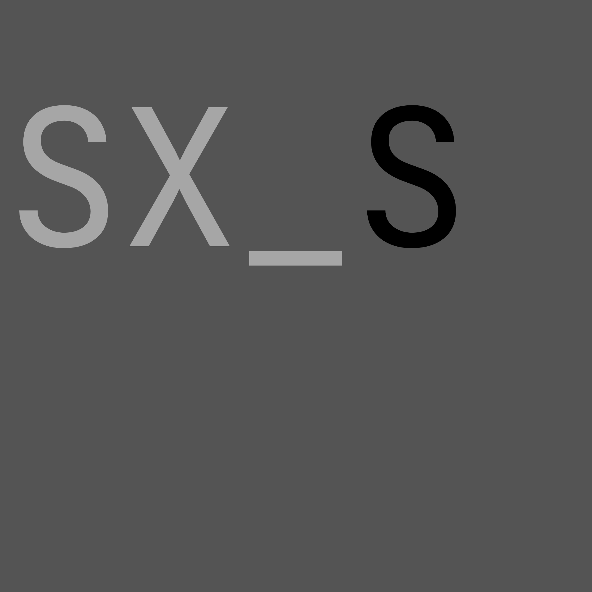

  

  # SXSEditor

  AI Singing Voice Synthesis Workstation

  
  
  
  

  **[Website](https://henley04.github.io/SXSEditor/) · [User Docs](https://henley04.github.io/SXSEditor/user/quick-start.html) · [Developer Docs](https://henley04.github.io/SXSEditor/dev/build.html)**

  **[English](#english) · [中文](#中文) · [日本語](#日本語)**

---

## English

SXSEditor is an open-source desktop application for singing voice synthesis. It uses the SoulX-Singer neural model running on ONNX Runtime with DirectML GPU, WebNN NPU/GPU, and CPU support.

Supported singing languages: **English**, **Chinese (Mandarin)**, and **Japanese**.

- [Website](https://henley04.github.io/SXSEditor/)
- [User Docs](https://henley04.github.io/SXSEditor/user/quick-start.html)
- [Developer Docs](https://henley04.github.io/SXSEditor/dev/build.html)
- [Application Updates](https://henley04.github.io/SXSEditor/user/app-updates.html)
- [Model Updates](https://henley04.github.io/SXSEditor/user/model-updates.html)
- [Help & FAQ](https://henley04.github.io/SXSEditor/user/faq.html)
- [Uninstall](https://henley04.github.io/SXSEditor/user/uninstall.html)

### License

[MIT](LICENSE)

---

## 中文

SXSEditor 是一个开源的桌面歌声合成应用。基于 SoulX-Singer 神经网络模型，通过 ONNX Runtime 运行，支持 DirectML GPU、WebNN NPU/GPU 和 CPU 推理。

支持的合成语言：**中文（普通话）**、**英语** 和 **日语**。

- [官网](https://henley04.github.io/SXSEditor/)
- [用户文档](https://henley04.github.io/SXSEditor/user/quick-start.html)
- [开发者文档](https://henley04.github.io/SXSEditor/dev/build.html)
- [应用更新](https://henley04.github.io/SXSEditor/user/app-updates.html)
- [模型更新](https://henley04.github.io/SXSEditor/user/model-updates.html)
- [帮助与常见问题](https://henley04.github.io/SXSEditor/user/faq.html)
- [卸载](https://henley04.github.io/SXSEditor/user/uninstall.html)

### 许可证

[MIT](LICENSE)

---

## 日本語

SXSEditor は歌声合成のためのオープンソースデスクトップアプリケーションです。SoulX-Singer ニューラルモデルを ONNX Runtime 上で動作させ、DirectML GPU、WebNN NPU/GPU、CPU をサポートします。

対応言語：**中国語（普通話）**、**英語**、**日本語**。

- [ウェブサイト](https://henley04.github.io/SXSEditor/)
- [ユーザードキュメント](https://henley04.github.io/SXSEditor/user/quick-start.html)
- [開発者ドキュメント](https://henley04.github.io/SXSEditor/dev/build.html)
- [アプリケーション更新](https://henley04.github.io/SXSEditor/user/app-updates.html)
- [モデル更新](https://henley04.github.io/SXSEditor/user/model-updates.html)
- [ヘルプ & FAQ](https://henley04.github.io/SXSEditor/user/faq.html)
- [アンインストール](https://henley04.github.io/SXSEditor/user/uninstall.html)

### ライセンス

[MIT](LICENSE)

**SXSEditor**

[GitHub](https://github.com/Henley04/SXSEditor) · [Issues](https://github.com/Henley04/SXSEditor/issues)

